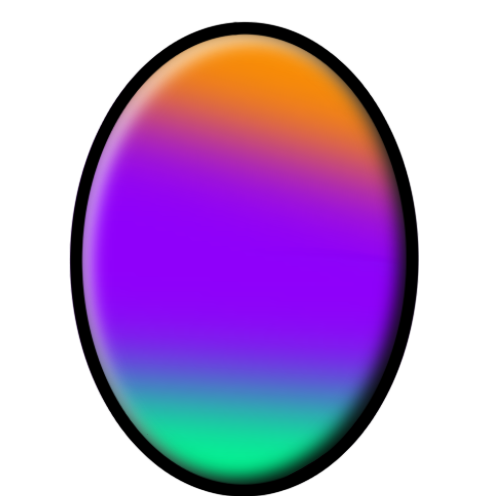

   
  
  <h1>Color-Chicken</h1>
  

    Be a feathered chameleon, master the hurdles in <b>Color Chicken</b>!
  

<!-- Badges -->

    
   
   
   

---

This project was generated with [Angular CLI](https://github.com/angular/angular-cli) version 15.2.6.

<!-- ---

- [Bugs](#bugs)

---

## Bugs

- _no known bugs_
 -->

---

by [Philipp B.](https://github.com/phil1436)
